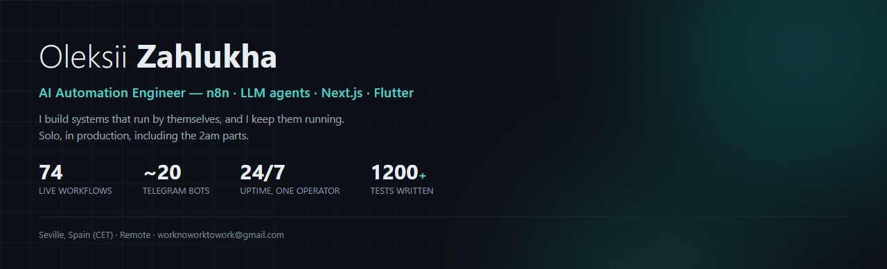
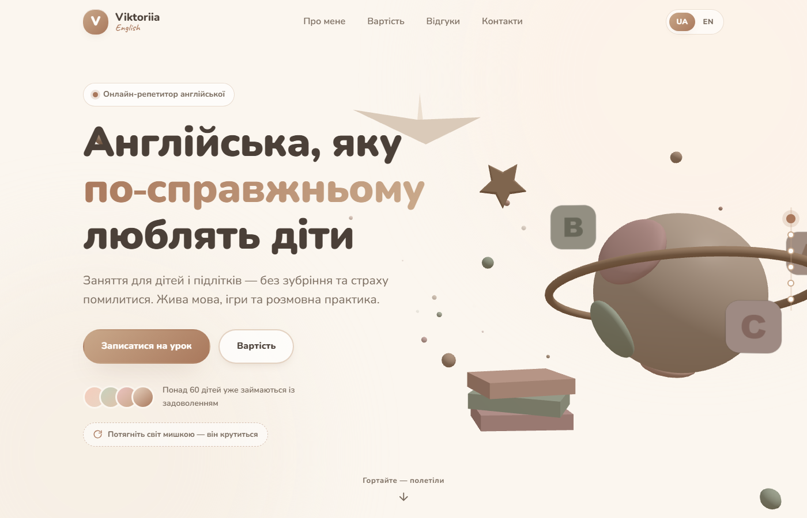
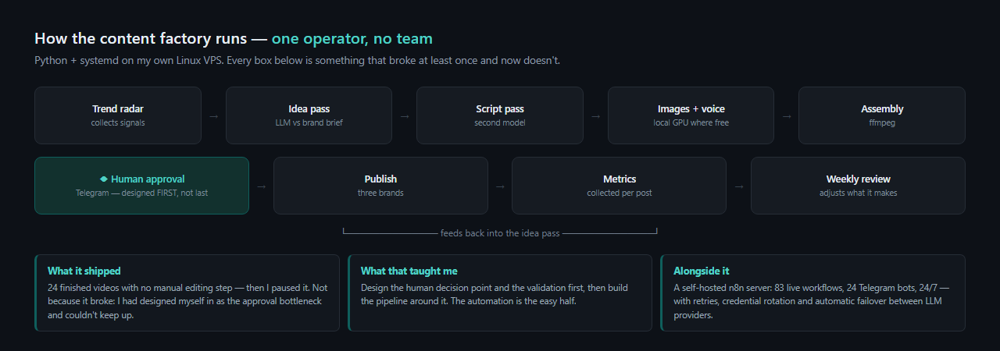

# Hi, I'm Oleksii 👋

**AI Automation Engineer** — I build systems that run by themselves, and I keep them running.

Seville, Spain (CET) · Working language: English · Open to remote roles and contract work
📫 **workinaiengineering@gmail.com**

---

## 👉 Short on time? Start here

| If you want to… | Open this | Time |
|---|---|---|
| **See a live site I built** | 🔗 **[alexolimb.github.io/englishviktoriia](https://alexolimb.github.io/englishviktoriia/)** — a landing page I designed and built end to end for an English tutor. Scroll and the camera flies through a pastel 3D world. Two languages · [source](https://github.com/Alexolimb/englishviktoriia) | 1 min |
| **Read my code** | **[Polaris-server](https://github.com/Alexolimb/Polaris-server)** — small, clean, zero dependencies, 41 tests. Clone it and run `npm test`: no install needed | 5 min |
| **See a full product** | **[Polaris](https://github.com/Alexolimb/Polaris)** — Flutter app, 338 tests, real architecture decisions written down in the README | 10 min |
| **Know what I'm actually best at** | The section below: **103 automation workflows (74 live right now) and around 20 bots running 24/7**, built and maintained by one person | 2 min |

Everything else on this page is private work — described here, and I'll walk you through any of it
on a call.

↑ **[alexolimb.github.io/englishviktoriia](https://alexolimb.github.io/englishviktoriia/)** — live. A landing page for an English tutor: the camera flies through a pastel 3D world as you scroll. Design, copy and build, end to end, two languages, contrast fixed to WCAG. [Source](https://github.com/Alexolimb/englishviktoriia).

---

## What runs in production right now

**A self-hosted n8n server** on my own Linux VPS — **74 active workflows out of 103 and around 20 Telegram bots**,
24/7. Built and maintained alone: deployment, retries, credential rotation, and switching providers by hand when one goes down — automatic failover is not built yet. Migrating agent workloads from paid APIs onto free tiers
cut the running cost to near zero without losing function.

**A local AI stack on my own GPU** (RTX 5060) — 6 local LLMs via Ollama, Whisper transcription,
TTS, vision models. Bulk and low-value work runs locally and free; paid models are used only where
the quality difference is measurable.

**Monitoring that actually checks reality.** My own status board doesn't ping for HTTP 200 — it
opens sites in a real browser, walks every n8n workflow, and listens for heartbeats from my desktop
apps. On its first run it caught a dead API key that my previous alerting had missed.

The system I'd most like to be judged on — and the one that taught me the most by failing. Full story below and in conversation.

---

## Projects

Most of these are private — products in development or work done for my day job. Listed so you can see the
range; happy to walk through any of them, or open one up, on a call.

### Automation, agents & infrastructure

| Project | What it is | Stack |
|---|---|---|
| **Content Factory** 🔒 | Autonomous content pipeline: trend radar → ideas → script → images, voice-over and music → video assembly (ffmpeg) → human approval in Telegram → publishing → metrics → weekly self-adjustment. Three brands running. Video generation moved onto my own GPU to keep it free | Python, systemd, Linux VPS |
| **Outreach Agent** 🔒 | A worker that runs 24/7: walks Google Maps with a headless browser, audits business websites with screenshots, filters out those who don't need one, finds contact emails **only from the business's own site**, drafts a letter about that site's specific weakness, and brings it to me for signature. Verified against my own manual work: 4/4 correct addresses, 0 invented | TypeScript, Node, Playwright |
| **Personal agent fleet** 🔒 | Six personal AI agents living on the server (training, sleep, nutrition, guardian, self-development, teacher) with a shared Telegram bot. They message first, on their own schedule | n8n, LLM APIs |
| **Orbita — status board** 🔒 | Shows ~30 projects as tiles with an honest colour each. Checks what a human would actually see, not what the server claims. Failure history, "check everything now" button, readable from a phone | TypeScript, Node |
| **Model Council** 🔒 | A group chat where eight LLMs from different vendors debate a question by name while one model chairs it — opens, steers, and writes the verdict | n8n, multi-provider |
| **Social scanner** 🔒 | Personal Instagram analyst over the official data export — saves, likes, topics — with a weekly written breakdown | n8n, web dashboard |

### Products & apps

| Project | What it is | Stack | Tests |
|---|---|---|---|
| **[Polaris](https://github.com/Alexolimb/Polaris)** 🟢 | Investment simulator and academy: virtual $10k portfolio, charts, dividends, AI mentor, 30 lessons, 3 languages. Money as integer cents, trades atomic by design | Flutter | **338** |
| **[Polaris-server](https://github.com/Alexolimb/Polaris-server)** 🟢 | Its backend — REST market data and an SSE-streaming LLM mentor with **zero external dependencies**. Runs and tests anywhere without `npm install` | Node.js | **41** |
| **NEXUS** 🔒 | Learning app that takes someone from zero to competent in code and AI — **18 chapters, 180 lessons, 162 coding exercises**, real code execution in a sandbox, spaced repetition, XP and streaks. Built for everyone from kids to pensioners | Electron, JS | **95** |
| **Promptmaker** 🔒 | Desktop app: one sentence about what you want → smart follow-up questions → a single well-formed prompt for the target model (13 targets: Claude, ChatGPT, Midjourney, Sora…) | Electron, TS | **194** |
| **Ami Pult** 🔒 | Desktop app that finds businesses without websites anywhere in the world (OpenStreetMap), scores them 0–100, and drafts a personal email to each in its own language using local models | Electron, TS | **143** |
| **Prisma** 🔒 | Translate anything, both directions: select text anywhere → translation by the cursor; write in your own language → it becomes another one in the input field. Plus text from images, PDF scans and video, voice input, and whole-window translation as overlays. Engines chain: own cache → Google → Groq → local Ollama, with a private mode that never leaves the machine | Electron, Python | **121** |
| **Nutri** 🔒 | Family nutrition app: the camera counts food and reads labels, an AI dietitian knows the family's diary and profiles, daily and weekly menus fit each person's targets and **real Mercadona prices in Seville**. Android + Windows from one codebase, 3 languages | Flutter | **25** |
| **Fluxo** 🔒 | Personal finance app (Windows + Android): expenses, subscriptions, bills, goals, AI chat, currencies. In daily real use, shared database with a Telegram bookkeeper bot | Flutter | **110** |
| **Dayo** 🔒 | Day planner — speak your day out loud, AI structures it. 1-3-5 method, 60% rule | Flutter | **69** |
| **Lingo HUD** 🔒 | Overlay window above Zoom for English lessons: the teacher logs learned words, the app returns them to the student exactly when they start to fade, sets a task using them, and tracks confirmation. Built for a teacher friend | Electron, Node | **62** |
| **FORGE** 🔒 | Sports atlas: 68 sports, interactive anatomy in 2D and 3D, hundreds of exercises with technique and muscle-engagement maps, programmes, live workout player, AI coach. Works offline | Electron, TS | — |
| **Zero** 🔒 | Voice assistant with a **local** brain — wake word, streaming answers, timers, media, weather. No cloud, no login, 0.3–0.6s response. Its engine runs 8 local models with role-based fallbacks, an agent with 33 tools, and retrieval over my notes | Python, Ollama | **85** |

### Web & professional tooling

| Project | What it is | Stack |
|---|---|---|
| **[englishviktoriia](https://alexolimb.github.io/englishviktoriia/)** 🟢 live | Landing page for an English tutor — pastel 3D world the camera flies through as you scroll, two languages, accessibility fixed to WCAG contrast. Design, copy and build, end to end | JS, Three.js |
| **Web studio / MOYA demo** 🔒 | Flagship template for small-business sites with 3D and motion, plus a demo case for a Seville brunch spot. Fixed the things that actually lose clients: an empty page without JS, link previews with no image, a broken 3D scene | Next.js, R3F |
| **Premiere Pro Panel** 🔒 | My own automation panel inside Adobe Premiere Pro: live subtitle translation, moment finding, multi-camera cutting, audio, markers and folders. **11 of 15 editing steps automated**, proven on real production footage. Built for any editing workflow, not tied to one studio | UXP panel, JS |

🟢 public · 🔒 private

---

## How I work

**I build with AI, and I'd rather you knew that up front.** I'm not a developer who types every
line — I direct AI agents against written specs and I verify what comes back. That's enough to
ship and operate the automation, integrations and LLM plumbing on this page, and it's why one
person can run this much. It is not enough to hand me your product codebase, and I won't pretend
otherwise. What I actually own is the part after launch: it runs, it's watched, and it gets fixed.

**Agentically, not by prompting and hoping.** Written specs, persistent project context, several
agent tracks in parallel, and verification of output rather than trust in it. Every project carries
its own written handbook — not for the agents, but because it's the only way to pick a project back
up two weeks later.

**I write tests** because I'm the only person who gets woken up when something breaks. There are
over 1,200 of them across the projects above.

**I check against reality.** My automations report what a human would see, not what an API claims.
Every one of my scrapers and agents has been graded against work I first did by hand.

---

## Stack

What these projects are built with. I work in all of it daily with AI doing the typing — deep on
n8n, agents and keeping things alive, working knowledge on the rest.

**Automation & AI** — n8n (self-hosted, production) · LLM APIs (Anthropic, Gemini, Groq, Cerebras) ·
agents & tool calling · RAG · Ollama & local models · Whisper · Telegram Bot API

**Web & apps** — TypeScript · JavaScript · Node.js · Next.js · React · Electron · Flutter / Dart ·
Python

**Infrastructure** — Linux VPS · Docker · systemd · REST APIs & webhooks · SSE · Playwright · Git ·
Vercel & Netlify · environment and secret management

---

## Background

Business degree, then years of client-facing work in video production — including editing for a US
studio, remotely and in English. I came to engineering by building the things I needed, and I
stayed because I turned out to be good at the part most people skip: keeping it alive after launch.
